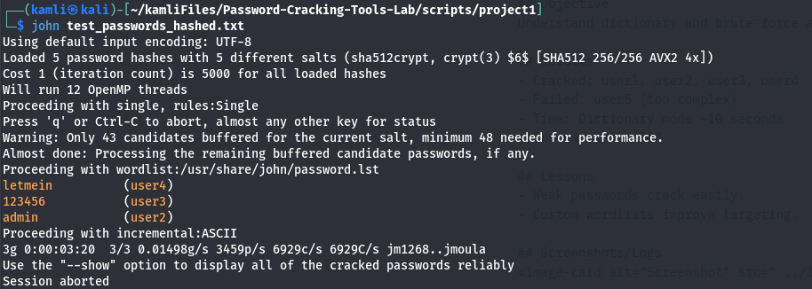

# Project 1: John the Ripper — Basic Password Cracking Lab (Detailed & Troubleshooting)

This document is an expanded, clarified, step-by-step guide for Project 1 (John the Ripper). It includes exact commands, scripts to create test files (plain & hashed), troubleshooting for the common "No password hashes loaded (see FAQ)" issue, recommended logging and commit messages, and a reporting template.

Estimated time: 2–3 hours.

---

## Overview / Objective
Learn how to use John the Ripper (john) in a safe lab to:
- create test password datasets,
- generate hashed-password files that john can process,
- run dictionary and incremental attacks,
- measure and document results,
- analyze why some passwords fail to crack.

Important: John cracks password *hashes*, not plain-text password files. If you try to run john on a file containing cleartext passwords (e.g., `user:password123`), you will get "No password hashes loaded (see FAQ)". This guide shows how to produce valid hashed inputs and how to troubleshoot.

---

## Prerequisites
- Kali Linux VM (or equivalent) with root or sudo access.
- Git and repo cloned locally:
  ```
  git clone https://github.com/kamleshsande85/Password-Cracking-Tools-Lab.git
  cd Password-Cracking-Tools-Lab
  ```
- Install required packages:
  ```
  sudo apt update
  sudo apt install john crunch whois -y
  ```
  - `whois` package provides `mkpasswd` on many systems. If `mkpasswd` is missing, install `whois`.
  - `crunch` is optional (wordlist generation).
  - Verify: `john --version`

---

## Repository layout (recommended for this project)
- scripts/project1/ — scripts and wordlists for Project 1
- logs/ — output logs and screenshots
- docs/project1.md — this document
- docs/project1-report.md — analysis & final report
- tracker.md — project tracker (update progress here)

Create folders if they don't exist:
```
mkdir -p scripts/project1 logs docs
```

---

## Files / Scripts (to add to the repo)

1) Plaintext test file generator (for demonstration only — john cannot use this directly):
```
scripts/project1/create_passwords.sh
```
Contents:
```bash
#!/bin/bash
# Creates a plaintext test_passwords.txt (NOT usable by john as-is)
echo "user1:password123" > scripts/project1/test_passwords.txt
echo "user2:admin" >> scripts/project1/test_passwords.txt
echo "user3:123456" >> scripts/project1/test_passwords.txt
echo "user4:letmein" >> scripts/project1/test_passwords.txt
echo "user5:strongPass!2023" >> scripts/project1/test_passwords.txt
echo "Created scripts/project1/test_passwords.txt with sample passwords."
```

2) Hashed password file generator (john-compatible):
```
scripts/project1/create_passwords_hashed.sh
```
Contents:
```bash
#!/bin/bash
# Creates hashed password file (SHA-512 hashes) that john can process
OUT="scripts/project1/test_passwords_hashed.txt"
: > "$OUT"
# mkpasswd -m sha-512 generates salted sha512 crypt strings
echo "user1:$(mkpasswd -m sha-512 password123)" >> "$OUT"
echo "user2:$(mkpasswd -m sha-512 admin)" >> "$OUT"
echo "user3:$(mkpasswd -m sha-512 123456)" >> "$OUT"
echo "user4:$(mkpasswd -m sha-512 letmein)" >> "$OUT"
echo "user5:$(mkpasswd -m sha-512 strongPass!2023)" >> "$OUT"
echo "Created $OUT with hashed passwords."
```
Notes:
- `mkpasswd` comes with the `whois` package on many distributions. If not present, install `whois`.
- The output file will contain username:hashed-password lines that john can attempt to crack (format resembles `/etc/shadow` entries for simple use).

3) Example custom wordlist generator (using crunch):
```
scripts/project1/generate_number_wordlist.sh
```
Contents:
```bash
#!/bin/bash
mkdir -p scripts/project1/wordlists
crunch 4 6 0123456789 -o scripts/project1/wordlists/custom_numbers.txt
echo "Created scripts/project1/wordlists/custom_numbers.txt (4-6 digit numbers)."
```

Make scripts executable:
```
chmod +x scripts/project1/*.sh
```

Recommended git commit message after adding scripts:
```
git add scripts/project1
git commit -m "Project 1: Add scripts to create plaintext and hashed test password files and custom wordlist generator"
git push
```

---

## Why you saw "No password hashes loaded"
- John expects hashed/encrypted passwords (e.g., MD5crypt, SHA-512 crypt, bcrypt, etc.). If you pass a plaintext file like `user1:password123`, john cannot interpret it as a hash and refuses to operate.
- Common causes:
  - You generated a plaintext file instead of hashed passwords.
  - You provided a file in an unsupported format (typo in filename, wrong separators).
  - You passed an unrelated file (e.g., README) by mistake.

Fix: Create a file with proper hashes (see create_passwords_hashed.sh) or use a real hashed file (like `/etc/shadow` extracted in a lab environment).

---

## Running john — commands & examples

1) Basic direct run (auto-detects format):
```
john scripts/project1/test_passwords_hashed.txt
```

2) Show cracked passwords:
```
john --show scripts/project1/test_passwords_hashed.txt
```

3) Use a wordlist (rockyou):
- Ensure rockyou is available and unzipped:
  ```
  sudo apt install wordlists -y   # in some distros
  sudo gunzip /usr/share/wordlists/rockyou.txt.gz     # if gzipped
  ```
- Run:
  ```
  john --wordlist=/usr/share/wordlists/rockyou.txt scripts/project1/test_passwords_hashed.txt
  ```

4) Wordlist + rules (mutations):
```
john --wordlist=/usr/share/wordlists/rockyou.txt --rules scripts/project1/test_passwords_hashed.txt
```

5) Incremental mode (slow brute-force; useful for demonstration):
```
john --incremental scripts/project1/test_passwords_hashed.txt
# Stop after a short time with Ctrl+C
```

6) Use custom wordlist:
```
john --wordlist=scripts/project1/wordlists/custom_numbers.txt scripts/project1/test_passwords_hashed.txt
```

7) Time a run:
```
time john --wordlist=/usr/share/wordlists/rockyou.txt scripts/project1/test_passwords_hashed.txt
```

---

## Logging outputs and screenshots (recommended)
- Save outputs to logs:
  ```
  john --show scripts/project1/test_passwords_hashed.txt > logs/project1-john-show.txt
  john --format=sha512crypt --wordlist=/usr/share/wordlists/rockyou.txt scripts/project1/test_passwords_hashed.txt > logs/project1-run-rockyou.txt
  ```
- Capture screenshots:
  - GNOME: `gnome-screenshot -w -f logs/project1-screenshot1.png`
  - KDE: `spectacle -w -o logs/project1-screenshot1.png`
- Commit logs & screenshots:
  ```
  git add logs/
  git commit -m "Project 1: Add john output logs and screenshots"
  git push
  ```

---

## Analysis & Report template (docs/project1-report.md)
Create a report with these sections (example content):
```
# Project 1 Report: John the Ripper

## Objective
Test john on a lab-generated hashed password file.

## Setup
- scripts/project1/create_passwords_hashed.sh used to generate SHA-512 hashed file.
- Wordlists: /usr/share/wordlists/rockyou.txt and custom_numbers.txt

## Results
- Cracked: user1 (password123), user2 (admin), user3 (123456), user4 (letmein)
- Failed: user5 (strongPass!2023) — complex, not in wordlists or rules
- Success rate: 4/5 (80%)
- Example times:
  - Dictionary (rockyou): ~X seconds
  - Custom numbers list: ~Y seconds

## Lessons Learned
- John requires hashes; plaintext files won't load.
- Common passwords crack very quickly with a wordlist.
- Strong, complex passwords resist dictionary+rule attacks.

## Artifacts
- logs/project1-john-show.txt
- logs/project1-run-rockyou.txt
- logs/project1-screenshot1.png
```
Fill actual times and takeaways after running the commands.

---

## Troubleshooting checklist
- If you see "No password hashes loaded":
  - Confirm file contains hashes (not plaintext).
  - Ensure the file format and separators are correct (username:hash).
  - Try explicit format if auto-detection fails: `john --format=sha512crypt`.
- If `mkpasswd` is not found:
  ```
  sudo apt install whois -y
  ```
- If rockyou is gzipped:
  ```
  sudo gunzip /usr/share/wordlists/rockyou.txt.gz
  ```
- If john complains unknown format, inspect the hash string and try a specific `--format=` option (see john docs).

---

## GitHub Issue / Tracker workflow (pre-project & wrap up)
1. Create Issue:
   - Title: "Project 1: John the Ripper - Basic Password Cracking Lab"
   - Body: paste tracker.md project1 checklist and add these labels:
     - Phase 1, Beginner, Tool: John
   - Assign to: @kamleshsande85
   - Add to Projects board → Ready → Move to In Progress when you start.

2. During work, make commits with clear messages:
   - "Project 1: Add scripts to create test files and wordlists"
   - "Project 1: Execute john runs and add logs"
   - "Project 1: Add analysis report"

3. When complete:
   - Update tracker.md: mark checkboxes done
   - Move issue to "In Review" → "Done" and close with comment:
     > Project 1 complete! Lessons: John requires hashes; dictionary attacks succeed on weak passwords; strong password resisted cracking.

---

## Optional Extensions
- Generate system-like /etc/shadow entries (for reading john features).
- Try different formats (MD5crypt, bcrypt) and learn how salt & cost affect cracking.
- Use `hashcat` for GPU-accelerated comparison (advanced).

---

## Final notes / common pitfalls
- Do NOT use real user data or production password hashes. This lab must use lab-generated passwords only.
- Double-check filenames and typos: `test_passwords.txt` vs `test_passwords_hashed.txt`.
- Keep artifacts (scripts, logs, screenshots) inside the repo to reproduce your work.

---

## My Screenshots/Logs



<!-- If the image still doesn't render on GitHub, ensure the file exists at 'logs/project1-screenshot1.png', the path is correct relative to this file, and the filename's case matches exactly. -->
